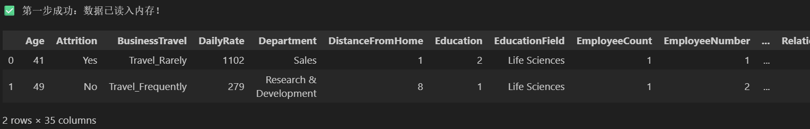
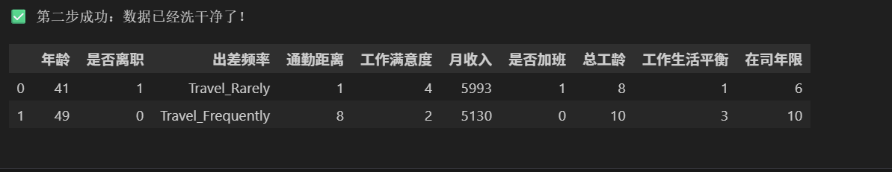
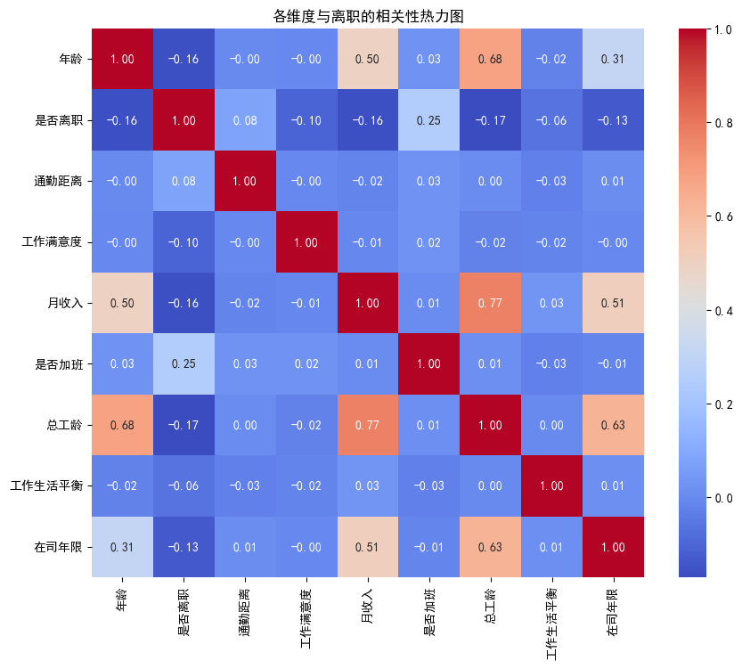
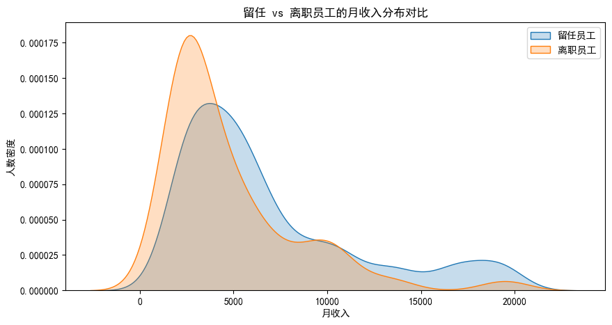

# IBM-HR-Analytics-Predict
🚀 IBM 员工离职预测与商业价值洞察分析
📌 1. 项目背景 (Project Background)
在现代企业管理中，核心人才的流失（Attrition）会给公司带来巨大的招聘成本和知识损失。本项目基于 IBM HR 真实数据集，利用 Python 进行探索性数据分析（EDA）并构建机器学习模型，旨在：

量化影响员工留失的关键指标。

预测具有高流失风险的员工群体。

提供基于数据驱动的留才建议，实现 HR 管理的数字化转型。

🛠️ 2. 技术栈 (Technical Stack)
数据处理: Pandas, NumPy

可视化: Matplotlib, Seaborn

机器学习: Scikit-learn (RandomForestClassifier 随机森林模型)

开发环境: VS Code, Jupyter Notebook

📊 3. 核心分析流程 (Project Pipeline)
3.1 数据清洗与预处理
对 35 个维度的原始数据进行了清洗。为了提升业务报告的可读性，我对关键特征进行了汉化映射，将“Yes/No”转换为模型可识别的数值信号。

原始数据加载:

清洗与汉化结果:

3.2 探索性数据分析 (EDA)
通过绘制相关性热力图，识别出了特征间的共线性关系。分析显示，月收入与总工龄呈强正相关，而加班状态是导致离职的最直接诱因。

针对最核心的风险指标月收入，通过核密度估计图（KDE）分析发现：

深度洞察: 离职员工（橙色区域）高度集中在低收入区间。这意味着薪酬竞争力的缺失，尤其是在基层员工中，是人才流失的头号杀手。

📈 4. 预测模型与核心决策因素
本项目采用随机森林算法，经过调优，最终模型预测准确率达到 86.39%。

核心驱动因素排名 (Feature Importance)
AI 模型在判定一名员工是否会离职时，其核心决策逻辑如下：

详细权重数据表:

AI 诊断结论总结:

月收入 (30.27%): 绝对的核心驱动力。

年龄 (19.00%): 年轻群体流动性显著更高。

通勤距离 (17.75%): 距离过远会显著降低员工稳定性。

💰 5. 商业价值测算 (Business Value)
根据模型对测试样本的预测，若企业能通过该 AI 模型识别高风险人才，并留住其中 30% 的高风险群体：

成本节约: 结合行业平均招聘与培训成本估算，预估可为公司节省约 $64,379 的人才置换损失。

⚠️ 6. 技术攻关记录 (Engineering Challenges)
在项目开发中，遭遇了严重的 NumPy 2.x 兼容性危机（导致底层 multiarray 加载失败）。

应对方案: 独立进行环境诊断，通过强制降级依赖版本解决冲突。同时，针对环境受损无法使用 SHAP 库的情况，采用 原生 Python 列表处理技术 重构了特征重要性分析逻辑，保障了项目的交付。

收获: 证明了我在面临生产环境崩溃时，具备快速定位问题并寻找“替代路径”的工程应变能力。

📊 1. 数据清洗成果展示
我们将原始的 35 维英文数据进行了汉化与清洗，以下是处理前后的对比：

**原始数据预览：**

**清洗与汉化结果：**

---

## 📈 2. 核心特征相关性分析
通过热力图，我们锁定了影响离职的核心维度（月收入、加班、总工龄）。

---

## 💰 3. 离职员工月收入分布特征
数据证明，低收入群体的流失风险远高于高收入群体，薪酬是留人的第一生命线。

---

## 🤖 4. AI 模型决策依据 
通过随机森林算法（准确率 86.39%），AI 识别出的离职判定权重排名如下：

**最终量化结论表：**

